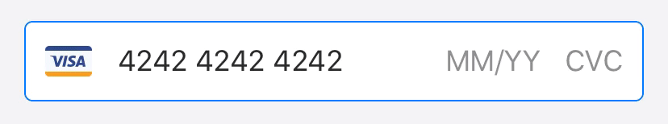

# SeamlessPay iOS

## Overview

SeamlessPay iOS provides ready-to-use UI components for collecting user payment details and processing payments. It also gives access to the underlying APIs that power these interfaces, allowing the development of completely customized experiences.`SeamlessPay` framework.

Start with the [📚 integration guide](https://docs.seamlesspay.com/ios-sdk).

## Prepare Development Environment

Install the necessary dependencies using Brew

`brew bundle`

## Switching SeamlessPay SDK Dependency Package Version from Remote to Local

In our iOS Example application, we use the Swift Package Manager (SPM) for managing dependencies. Sometimes, you might want to switch a dependency from a remote version to a local version for development and debugging purposes. Here’s how you can achieve this in our Example application.

### Steps to Switch to a Local Version

#### Open Example app in Xcode

- Open the Demo.xcodeproj file of the Example application in Xcode.

#### Navigate to Package Dependencies

- In the project navigator, select your project file to open the project settings.

- Go to the Package Dependencies tab to view the list of currently integrated packages.

#### Remove reference to the Remote Location

- Select the SeamlessPay package. Click the - button and confirm that you want to remove the package.

#### Add the Local Package

- Click the + button at the bottom of the Package Dependencies tab.

- In the dialog that appears, click Add Local...

- Navigate to the local path where you cloned the package repository, and select the package directory.

#### Build and Run

- Xcode will resolve the package and add it to your project.
- Build and run your project to ensure that the local version of the package is being used.
